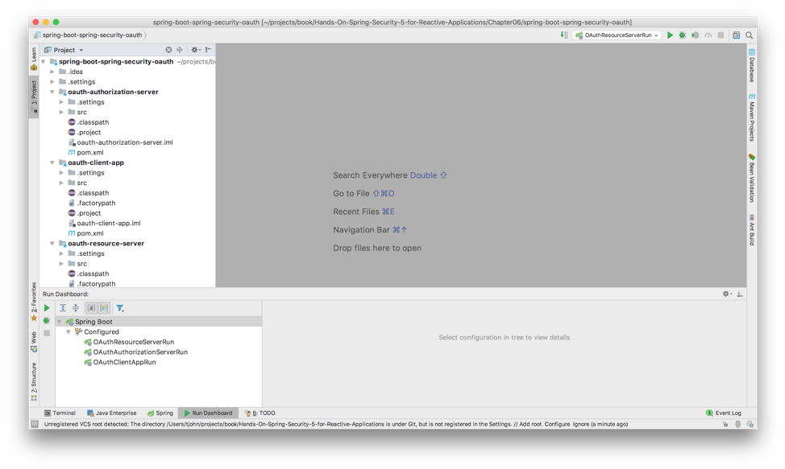
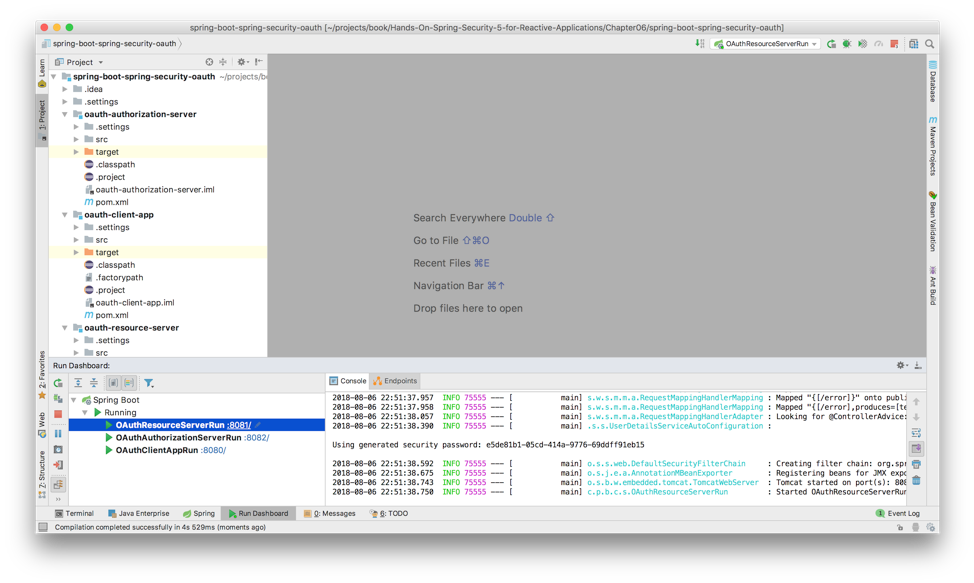
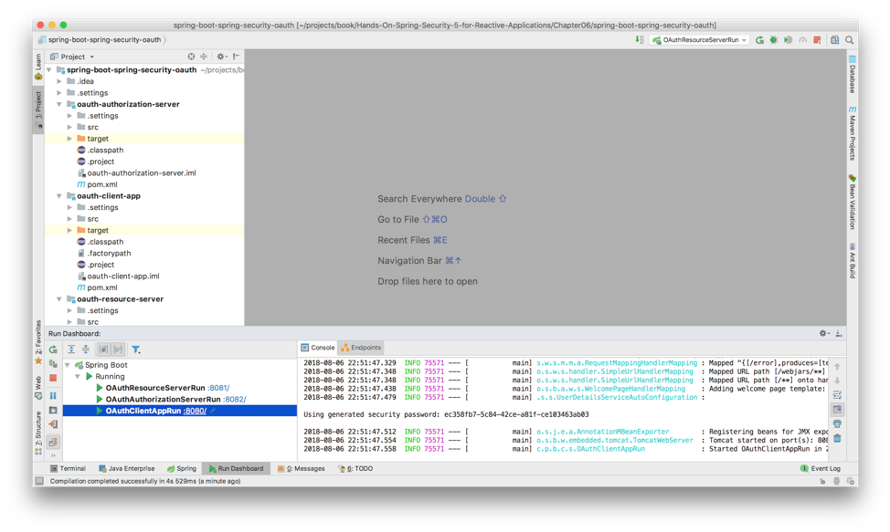
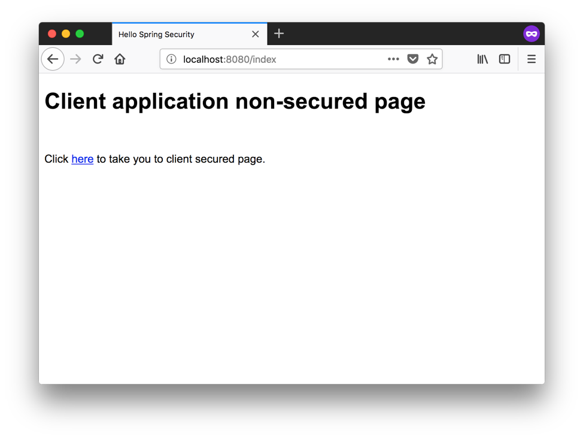
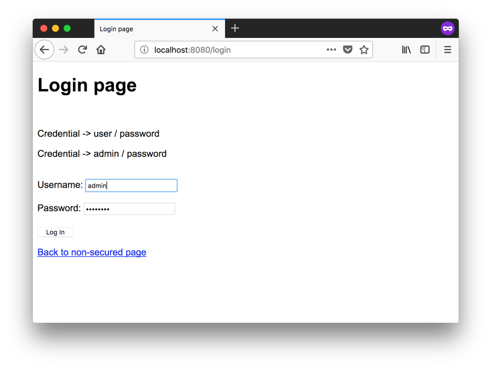
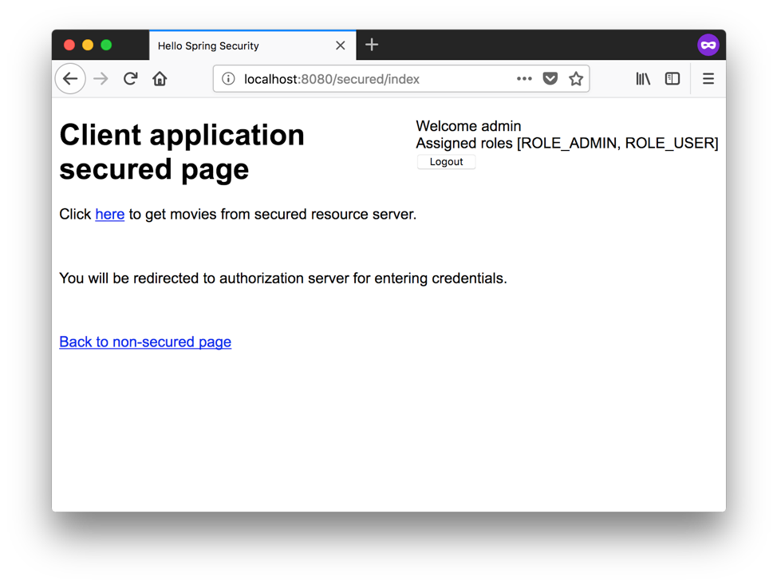
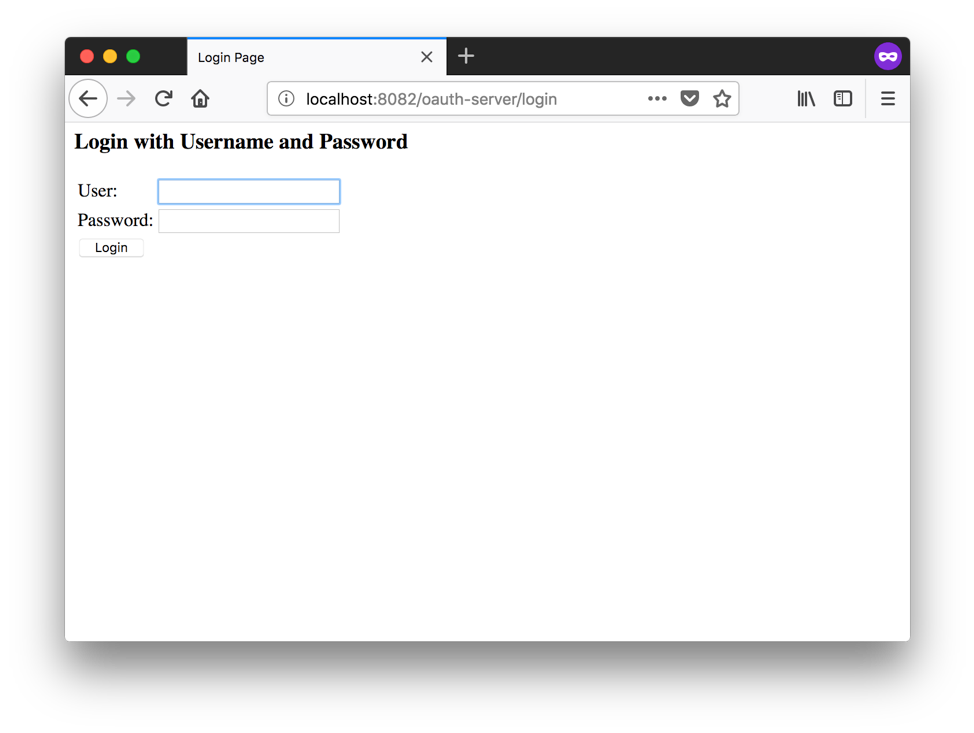
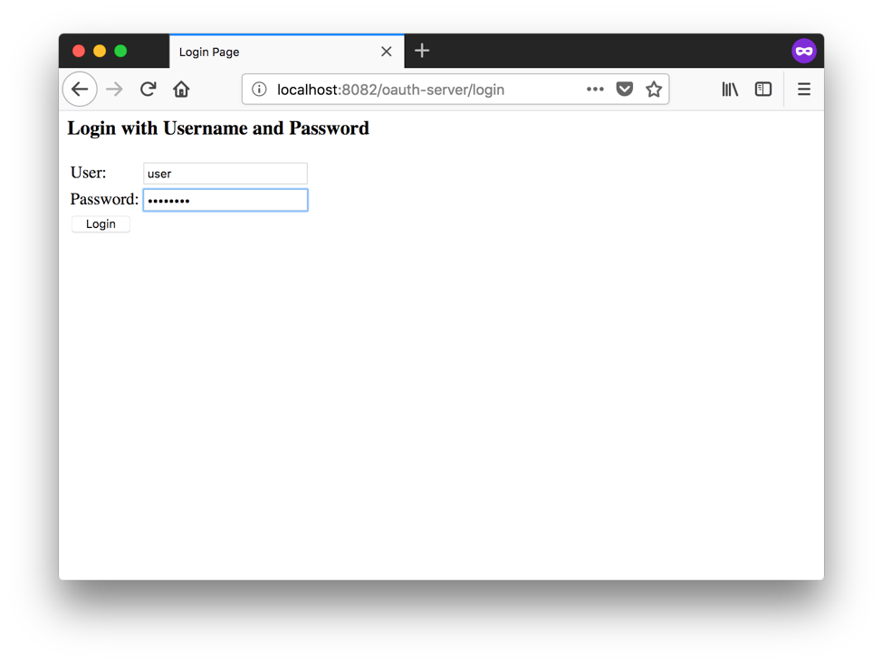
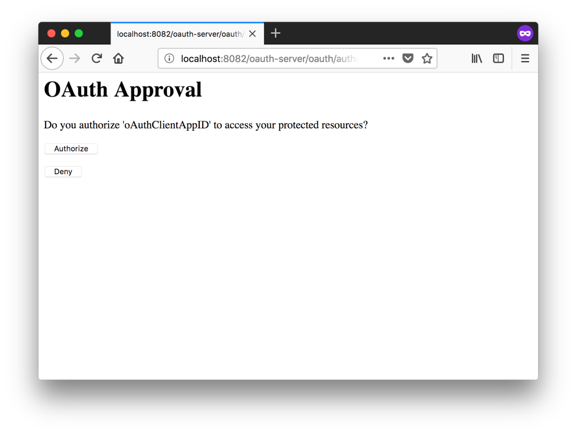

# Spring WebFlux base application integrated with Spring Security running on Spring Boot showing off advanced authentication using OAuth components
  
  
  

  

  

  

  
  
  

  

  

  

  
  
  
